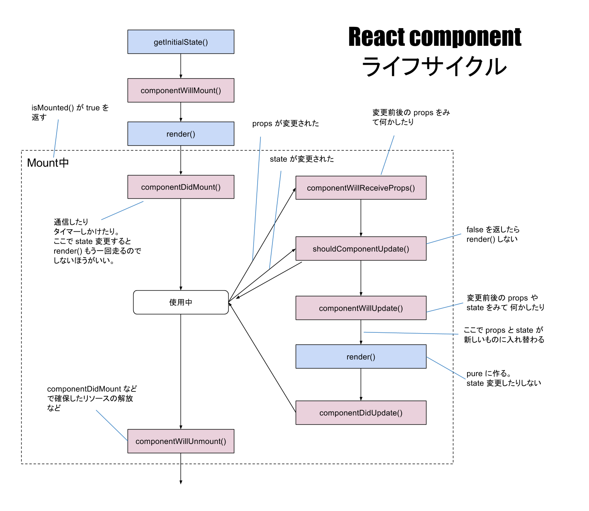

  <h2>
    <a href="http://facebook.github.io/react/">A JavaScript library for building user interfaces | React</a>
  </h2>

#### References
- [React Cheat Sheet](http://reactcheatsheet.com/)

## Intro
- [Introduction To React // Speaker Deck](https://speakerdeck.com/hokaccha/introduction-to-react)
    - [今話題のReact.jsはどのようなWebアプリケーションに適しているか？ Introduction To React─ Frontrend Conference](http://html5experts.jp/hokaccha/13301/)
- [ReactJS For Stupid People](http://blog.andrewray.me/reactjs-for-stupid-people/)
- [Isomorphic Web Apps and React.js](http://jsforallof.us/2015/02/23/isomorphic-web-apps-and-react-js/)
- [Ajaxを劇的に簡単にするReact.js – @masuidrive blog](http://blog.masuidrive.jp/2015/03/03/react/)
- [reactjs - React 雑感 - Qiita](http://qiita.com/naoya@github/items/a4d54f5ab008c3fa4055)
- [React概論 // Speaker Deck](https://speakerdeck.com/naoya/reactgai-lun)
- [React.js + Flux入門 #scripty02](http://www.slideshare.net/techblogyahoo/reactjs-flux-scripty02)

### Props & state

- [JSといえばjQueryだったWebデザイナーが、Reactを1年間使って感じたメリット | dwango creators' blog（ドワンゴクリエイターズブログ）](http://creator.dwango.co.jp/3413.html)

### Component ライフサイクル

- [React component ライフサイクル図 \- Qiita](http://qiita.com/kawachi/items/092bfc281f88e3a6e456)

## Learning
- __[Reactの公式チュートリアルをやってみた＆メモ - syonx](http://syonx.hatenablog.com/entry/2015/03/15/060000)__
- __[Awesome React](https://github.com/enaqx/awesome-react)__
- [いま最も注目のライブラリ「React.js」でシングルページアプリケーションを作ってみよう！ 【前編】 （1/3）：CodeZine](http://codezine.jp/article/detail/8491)
- [JavaScript - React.js 実戦投入への道 - Qiita](http://qiita.com/icoxfog417/items/5d79b3336226aa51e30d)
- [O'Reilly Japan - 入門 React](http://www.oreilly.co.jp/books/9784873117195/)
- [petehunt/react-howto](https://github.com/petehunt/react-howto)
  - [petehunt/react-howto の日本語訳 - console.lealog();](http://lealog.hateblo.jp/entry/2016/01/07/170707)

#### React Router
[reactjs/react-router: A complete routing library for React](https://github.com/reactjs/react-router)

- __[React Routerの公式チュートリアルがわかりやすかったよ - syonx](http://syonx.hatenablog.com/entry/2016/02/28/160557)__
- [React初心者のためのreact-routerの使い方 - ハッカーを目指す白Tのブログ](http://beck23.hatenablog.com/entry/2015/02/20/054900)
- [React-Router with Flux - Jake Trent](http://jaketrent.com/post/react-router-with-flux/)
- [You might not need React Router — Medium](https://medium.com/@tarkus/you-might-not-need-react-router-38673620f3d#.fn0q2pm2g)

## Flux
- [reactjs - React.jsとFlux - Qiita](http://qiita.com/koba04/items/b32ba449d753fdb2b597)
- [ReactとFluxのこと // Speaker Deck](https://speakerdeck.com/geta6/reacttofluxfalsekoto)
- [ReactとFluxでクライアントサイドの設計 | KRAY Inc](http://kray.jp/blog/react-flux/)
- [Fluxフレームワーク戦争の現状確認（前編） - マルシテイアは月の上](http://amagitakayosi.hatenablog.com/entry/2015/12/02/172453)
- [Fluxフレームワーク戦争の現状確認（後編） - マルシテイアは月の上](http://amagitakayosi.hatenablog.com/entry/2015/12/25/080000)
- [FluxのActionとStoreをちゃんと分ける話 - pixiv inside](http://inside.pixiv.net/entry/2015/12/19/113746)
- [redux への 不満を解消する為に, flumptというFlux実装を作った - Qiita](http://qiita.com/mizchi/items/79673c4d406cc85b44aa)
- [React+fluxを導入した話](http://www.slideshare.net/hoto17296/reactflux)

### Redux

- [Reactive State Machine \(Japanese\) // Speaker Deck](https://speakerdeck.com/inamiy/reactive-state-machine-japanese)
- [Introduction to Redux // Speaker Deck](https://speakerdeck.com/axross/introduction-to-redux)
- [mizchi の Redux 考 \- Togetterまとめ](https://togetter.com/li/911228)
- [Coffee, jQueryで書いていたElectronアプリをES6, React, Reduxで書き直した \- k0kubun's blog](http://k0kubun.hatenablog.com/entry/2016/03/21/114626)
- [Reduxから見えてきた希望と課題 | eureka tech blog](https://developers.eure.jp/tech/redux_feature/)
- [React + Redux入門初歩　実際に一からアプリを構築してみる - Qiita](http://qiita.com/pentamania/items/859fe5f2f7e9cf12d6ca)
- [React、Redux、D3を用いたアニメーション | プログラミング | POSTD](http://postd.cc/animating-with-react-redux-and-d3/)
- [なぜReduxを使うのか // Speaker Deck](https://speakerdeck.com/kuy/nazereduxwoshi-ufalseka)
- [Clean Architecture in React – Medium](https://medium.com/@axross/wip-react-clean-architecture-386c950d8b3a#.vgygwct23)
- [ReduxのExampleを徹底図解 \| 人生と仕事を楽しむブログ](http://blog.andgenie.jp/articles/1021)
- [React Reduxスターターキット \- Qiita](http://qiita.com/ossan-engineer/items/25babf2025bfe1968b9b)
- [ReduxでのMiddleware不要論 \- Qiita](http://qiita.com/uryyyyyyy/items/d8bae6a7fca1c4732696)
- [React&Reduxを牛丼屋に例えてみる図 \- Qiita](http://qiita.com/arihito@github/items/f5550de00e22e3dc9bc9)
- [Reduxの正しい解釈の話 – Medium](https://medium.com/@axross/undertanding-truthful-redux-with-usecases-179eefd9fd55#.xx60yyu8a)

### MobX
[Introduction \| MobX](https://mobx.js.org/)

- [React Native / React Navigation を Mobx と使う \| Workabroad\.jp](http://www.workabroad.jp/posts/2206)

## Boilerplate

- [Babel \+ React \+ Webpack の最小構成ひな形作った \- Qiita](http://qiita.com/ktrysmt/items/aba22b8b3a1fd2031985)

## Style Guide
- [[翻訳] Airbnb React/JSX Style Guide - Qiita](http://qiita.com/koukun/items/e64762e407b8dd5e0247)

## Tools
- [facebook/react-devtools](https://github.com/facebook/react-devtools)
- [React Studio](https://reactstudio.com/)

## Components

[Material UI - Material Design React Components](http://callemall.github.io/material-ui/#/)
: - [ReactJs-ReactNative-examples/examples/size-and-speed](https://github.com/liesislukas/ReactJs-ReactNative-examples/tree/master/examples/size-and-speed)  
  Size and Speed

[D3 Components for React](https://github.com/codesuki/react-d3-components)
: - [React D3 Components Examples](http://codesuki.github.io/react-d3-components/example.html)

[A carefully crafted datagrid for React](http://zippyui.github.io/react-datagrid/#/)
: テーブル描画コンポーネント。ハイパフォーマンス、列幅調整、列ON/OFFなど。

[gabrielbull/react-desktop · GitHub](https://github.com/gabrielbull/react-desktop)
: React UI Components for OS X El Capitan and Windows 10

[React Toolbox](http://react-toolbox.com/)
: Bootstrap your application with beautiful Material Design Components

[Blueprint](http://blueprintjs.com/)
: A React-based UI toolkit for the web

[Grommet](https://grommet.github.io/)
: The most advanced UX framework for enterprise applications.
- [Topology | Grommet](https://grommet.github.io/docs/topology/examples/)

[React-Bootstrap](http://react-bootstrap.github.io/)
: Bootstrap 3 components built with React

[Ring UI](http://www.jetbrains.org/ring-ui/index.html)
: [JetBrainsのWeb UIコンポーネントをオープンソース化 \| JetBrains ブログ](https://blog.jetbrains.com/jp/2017/08/04/782)

[Rebass](http://jxnblk.com/rebass/)
: 57 Configurable React Stateless Functional UI Components

[Office UI Fabric](https://dev.office.com/fabric#/)
: The official front-end framework for building experiences that fit seamlessly into Office and Office 365.

[Draft.js](https://draftjs.org/)
: Rich Text Editor Framework for React

#### Styling
- [Radium - A React Component Styling Library](http://projects.formidablelabs.com/radium/)

#### Modal
- [React Modal Dialog](http://www.qimingweng.com/react-modal-dialog/)
- [React\.jsでModal componentの実装](http://c16e.com/1509031043/)

#### Sound
- [leoasis/react\-sound: Sound component to play audio in your web apps](https://github.com/leoasis/react-sound)

#### Articles
- [早く・それなりの UI を実現する React コンポーネントセット 16 選 \- Qiita](http://qiita.com/kyrieleison/items/39ce30dd2d204791a9ea)
- [React\.js in patterns](http://krasimirtsonev.com/blog/article/react-js-in-design-patterns)
- [ReactのUIコンポーネントライブラリの一覧表\(2017/5版\) \- Qiita](http://qiita.com/tashxii/items/6e3e25e8b0f690570920)

## Examples
- [23 Chart Examples with ReactJS](http://react.rocks/tag/Chart)

## Articles
- [React.jsを触った感想 - axross blog](http://blog.axross.org/entry/2014/12/25/100000)
- [リアルな DOM はなぜ遅いのか - steps to phantasien](http://steps.dodgson.org/b/2014/12/11/why-is-real-dom-slow/)
- [reactjs - react-jadeでjadeテンプレートから仮想DOMを出力する - Qiita](http://qiita.com/mizchi/items/4e17b54cd9cc70d747cc)
- [React.js: an interactive tutorial to get started](http://projs.hackhat.com/react-js-an-interactive-tutorial-to-get-started/)
- [React JS and why it's awesome](http://www.slideshare.net/AndrewHull/react-js-and-why-its-awesome)
- [Integrating D3.js visualizations in a React app - Nicolas Hery](http://nicolashery.com/integrating-d3js-visualizations-in-a-react-app/)
- [Using React.js to draw dynamic SVGs](http://biesnecker.com/2014/10/22/using-reactjs-to-draw-dynamic-svgs/)
- [React / SVG / Canvas でパフォーマンス比較してみた。 - ましまろブログ](http://mashimallow.hatenablog.com/entry/2015/02/02/225250)
- [React.jsをCoffeeScriptとjadeで書く | uzimith.github.io](https://uzimith.github.io/2015/02/13/react-jade-coffee/)
- [3, 4 日で React を案件に導入(先っちょだけ)した話 - Qiita](http://qiita.com/monpy/items/cd6ff929aa52a832df5c)
- [reactjs - javascript再勉強のためにreact + ardaでマインスイーパーをつくったので気づきを忘れないようにメモ - Qiita](http://qiita.com/mmmpa/items/dfdf0f4de70b42ad1138)
- [Reactのprops/stateとFluxのStore - mizchi's blog](http://mizchi.hatenablog.com/entry/2015/08/24/233919)
- [Reactを用いたアプリケーションアーキテクチャ：Fluxを再考する | プログラミング | POSTD](http://postd.cc/application-architecture-with-react-rethinking-flux/)
- [#スーパーイカメーカー を支える技術 - console.lealog();](http://lealog.hateblo.jp/entry/2016/01/22/115913)
- [Reactを使ったプロダクトのパフォーマンスを改善した話 | GMOメディア エンジニアブログ](http://tech.gmo-media.jp/post/141458071484/react-perf-tuning)
- [すべてのReact.js初心者が知っておくべき9つのポイント - Qiita](http://qiita.com/ossan-engineer/items/3622e57ceb70c7f12295)
- [その案件、Reactで本当に大丈夫ですか？ | eureka tech blog](https://developers.eure.jp/tech/react_or_not/)
- [The state of React.js 2016 // Speaker Deck](https://speakerdeck.com/koba04/the-state-of-react-dot-js-2016)
- [Reactの最新動向とベストプラクティス ── HTML5 Conference 2016セッションレポート \| HTML5Experts\.jp](https://html5experts.jp/koba04/20839/)

## Next.js
[zeit/next\.js: Framework for server\-rendered React apps](https://github.com/zeit/next.js)

- [Next\.js \- Qiita](http://qiita.com/nkzawa/items/1e0e93efd13fb982c8c0)  
  https://zeit.co/blog/next の翻訳
- [Reactで学ぶ！いまどきのWeb開発 // Speaker Deck](https://speakerdeck.com/fand/reactdexue-bu-imadokifalsewebkai-fa)

## React Native
- → __[React Native](/wiki/reactnative/)__
